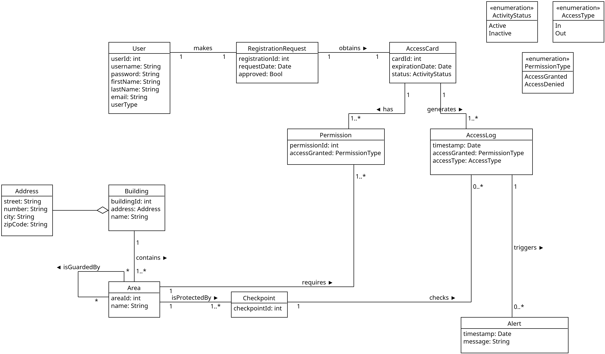

# FacilityGuard: Physical Access Control System


## Table of Contents
* [Overview](#overview)
* [Key Features](#key-features)
* [User Roles & Requirements](#user-roles--requirements)
* [System Functionality](#system-functionality)
* [Design & Modeling](#design--modeling)
* [Tech Stack](#tech-stack)
* [Project Architecture](#project-architecture)
* [Getting Started](#getting-started)
* [Default Data Scenarios](#default-data-scenarios)
* [API Reference](#api-reference)
* [Troubleshooting](#troubleshooting)

---

## <a name="overview"></a> Overview

**FacilityGuard** is a backend service designed to simulate and manage physical security checkpoints (e.g., RFID card readers, biometric scanners). It processes access requests in real-time using a multi-stage security pipeline to ensure that only authorized personnel can access specific areas.

The system handles everything from **User & Card Management** to complex **Security Logic** like Anti-Passback and Spatial Topology checks.

---

## <a name="user-roles--requirements"></a> User Roles & Requirements

The system supports distinct user categories with specific capabilities:

### ● Authorized Employees / Visitors
* **Access Credentials:** Possess valid access identities (cards) to interact with the physical security system.
* **Self-Service:** Can log in to the system to manage personal profile details, but **cannot** modify their own access rights.
* **Requests:** Can request registration and the issuance of new access cards.

### ● System Administrators
* **Access Credentials:** Possess valid access identities (cards) for physical access.
* **Infrastructure Management:** Responsible for registering buildings and configuring access control checkpoints.
* **Card Provisioning:** Process registration requests and issue access cards immediately upon request from users (Employees/Visitors).
* **Access Control:** Grant or revoke access rights to specific buildings and internal zones for each user.

---

## <a name="system-functionality"></a> System Functionality

The FacilityGuard software implements the following core functions:

* **Authorization Logic:** Verifies if a user has the specific permission to enter a requested area.
* **Access Actuation:** Unlocks the entry point (door/turnstile) upon successful verification.
* **Permission Management:** Allows granular definition and management of access rights for every user.
* **Audit Trail:** Logs the exact date, time, and location of every access attempt.
* **Security Alerting:** Generates real-time notifications for the management team in case of security breaches or policy violations.
* **Live Reporting:** Provides reports on the individuals currently present in each facility based on access logs.
* **Historical Data:** Maintains a complete history of user presence and access movements per building.

---

## <a name="design--modeling"></a> Design & Modeling

### Domain Model
The core entities and their relationships are structured as follows:



---

## <a name="key-features"></a> Key Features

### Security Pipeline
Every access request goes through a strict validation chain:
1.  **Card Validation:** Checks if the card is Active and not Expired.
2.  **Anti-Passback:** Prevents a user from entering an area if they are already inside (or exiting if they are outside).
3.  **Topology Check:** Ensures the user is moving between physically connected (neighboring) areas.
4.  **Authorization:** Verifies if the card has specific permissions for the target Area.

### Domain Management
* **Buildings & Areas:** Manage complex facility structures (Lobbies, Server Rooms, Parking).
* **Checkpoints:** Digital representations of physical doors/turnstiles.
* **Users & Roles:** Support for *Administrator*, *Employee*, and *Visitor* roles.

### Monitoring & Auditing
* **Access Logs:** Immutable history of every entry/exit attempt.
* **Security Alerts:** Automatic generation of alerts for security violations (e.g., trying to enter a denied zone, passback violations).

---

## <a name="tech-stack"></a> Tech Stack

* **Core Framework:** [Quarkus](https://quarkus.io/) (Supersonic Subatomic Java)
* **Language:** Java 17+
* **Database:** H2 (In-Memory/File for Dev), Hibernate ORM with Panache
* **Testing:** JUnit 5, RestAssured
* **Build Tool:** Maven

---

## <a name="project-architecture"></a> Project Architecture

The project follows a clean architecture pattern:

* **`domain`**: JPA Entities (`User`, `AccessCard`, `Area`, `Checkpoint`, `Permission`, etc.).
* **`persistence`**: Repository layer using Hibernate Panache.
* **`service`**: Business logic (e.g., `AccessControlService` containing the security pipeline).
* **`resource`**: REST API Controllers (JAX-RS).
* **`lifecycle`**: Data initializers for development scenarios.

---

## <a name="getting-started"></a> Getting Started

### Prerequisites
* JDK 17 or later installed.
* Maven 3.8+ (or use the included `./mvnw` wrapper).

### Running the Application (Dev Mode)
To run the application with **Hot Reload** and **Live Coding**:

```bash
./mvnw compile quarkus:dev
```

#### The application will be available at:
- API Root: `http://localhost:8080`
- Swagger UI: `http://localhost:8080/q/swagger-ui`
- Dev UI: `http://localhost:8080/q/dev`

### Running Tests
To execute the Unit and Integration tests (including the scenarios for Passback and Topology):

```Bash
./mvnw test
```
### <a name="default-data-scenarios"></a> Default Data Scenarios
When running in Dev Mode, the system automatically initializes a rich dataset to help you test immediately (see [`DataInitializer.java`](https://github.com/EleniKechrioti/Facility-Guard/blob/main/FacilityGuard/src/main/java/org/aueb/util/DataInitializer.java)).

Pre-configured Users: 

| User | Role | Access Rights | Notes | 
| :--- | :--- | :--- | :--- | 
| admin | Administrator | N/A | Can issue cards/approve requests. | 
| alice | Employee | Full Access | Can enter Lobby, Offices, Server Room. | 
| john | Employee | Restricted | Can enter Offices. | 
| maria | Intern | Lobby Only | Cannot enter Offices. | 
| costas | Visitor | None | Pending registration request (No card). |

## <a name="api-reference"></a> API Reference

Full documentation and interactive testing are available via **Swagger UI** at `/q/swagger-ui` when running in Dev Mode.

<details> <summary><b> Click to expand API Endpoints list</b></summary>
<br>
<details> <summary><b>Access Control & Monitoring</b></summary>

| Method | Endpoint | Description |
| :--- | :--- | :--- |
| **POST** | `/access/request` | **Core:** Process an access request (Swipe Card). |
| **GET** | `/access/location/{cardId}` | Check if a specific card holder is currently inside. |
| **GET** | `/access-logs` | Retrieve the full history of access attempts. |
| **GET** | `/access-logs/between` | Filter access logs by date range. |
| **GET** | `/access-logs/card/{cardId}` | Get access history for a specific card. |
| **GET** | `/access-logs/checkpoint/{checkpointId}` | Get history for a specific checkpoint. |
| **GET** | `/access-logs/denied` | Retrieve only **DENIED** access attempts (Security Auditing). |
| **GET** | `/access-logs/last/{n}` | Get the last *N* logs. |
| **GET** | `/alerts` | Retrieve generated security alerts. |
</details>

<details> <summary><b> Access Card Management </b></summary>

| Method | Endpoint | Description |
| :--- | :--- | :--- |
| **POST** | `/cards/issue` | Issue a new access card for a user. |
| **GET** | `/cards/{id}` | Get card details. |
| **GET** | `/cards/user/{userId}` | Find the active card for a specific user. |
| **PUT** | `/cards/{id}/deactivate` | Deactivate a card immediately (Lost/Stolen). |
| **POST** | `/cards/{id}/permissions` | Grant access permission for a specific area. |
| **GET** | `/cards/{id}/permissions` | List all permissions granted to a card. |
</details>

<details> <summary><b> Registration Requests</b></summary>

| Method | Endpoint | Description |
| :--- | :--- | :--- |
| **POST** | `/requests` | Submit a new registration request (Visitor/Employee). |
| **GET** | `/requests/pending` | List all pending requests (for Admin review). |
| **PUT** | `/requests/{id}/approve` | Approve a request (activates user/issues card). |
| **PUT** | `/requests/{id}/reject` | Reject a registration request. |
</details>

<details> <summary><b> Infrastructure (Buildings & Areas)</b></summary>

| Method | Endpoint | Description |
| :--- | :--- | :--- |
| **GET** | `/buildings` | List all registered buildings. |
| **POST** | `/buildings` | Register a new building. |
| **POST** | `/buildings/{id}/areas` | Add a new Area (Zone) to a building. |
| **GET** | `/buildings/{id}/areas` | Get all Areas within a building. |
| **POST** | `/buildings/{buildingId}/areas/{areaId}/checkpoints` | Add a Checkpoint to an Area. |
| **GET** | `/buildings/{buildingId}/areas/{areaId}/checkpoints` | Get all Checkpoints in a specific Area. |
| **PUT** | `/buildings/areas/{areaId}/neighbors/{neighborId}` | **Topology:** Connect two areas as neighbors. |
| **DELETE** | `/buildings/areas/{areaId}/neighbors/{neighborId}` | **Topology:** Disconnect two neighbor areas. |
</details>

<details> <summary><b> User Management</b></summary>

| Method | Endpoint | Description |
| :--- | :--- | :--- |
| **GET** | `/users` | List all system users. |
| **POST** | `/users` | Create a user manually. |
| **GET** | `/users/{id}` | Get user details. |
| **PUT** | `/users/{id}` | Update user details. |
| **DELETE** | `/users/{id}` | Remove a user from the system. |
</details>
</details>

##  API Examples
### 1. Request Access (Simulate Card Reader)
**POST** `/access/request`

```JSON
{
  "cardId": 1,
  "checkpointId": 2,
  "accessType": "In"
}
```
**Response (Success):**

```JSON
{
  "status": "GRANTED"
}
```
**Response (Failure - e.g., Expired Card):**

```JSON
{
  "status": "DENIED"
}
```
### 2. Issue a New Card
**POST** `/cards/issue`

```JSON
{
  "userId": 5,
  "expirationDate": "2026-12-31"
}
```
### 3. Check User Location
**GET** `/access/location/{cardId}`

**Response:**

```JSON
{
  "status": "INSIDE",
  "area": "Server Room"
}
```
---

## Troubleshooting
"Database may be already in use" Error: 

If you try to run tests or mvn clean and get a database lock error:
- Stop the running Quarkus instance (`Ctrl+C`).
- Ensure no background Java processes are holding the `.mv.db` file.
